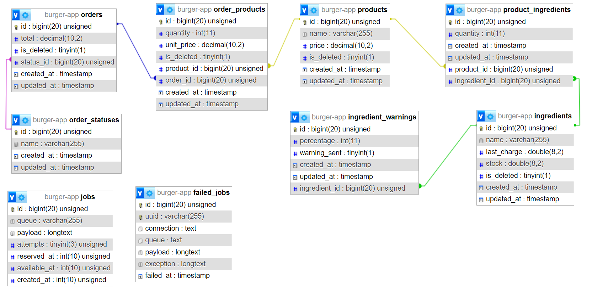
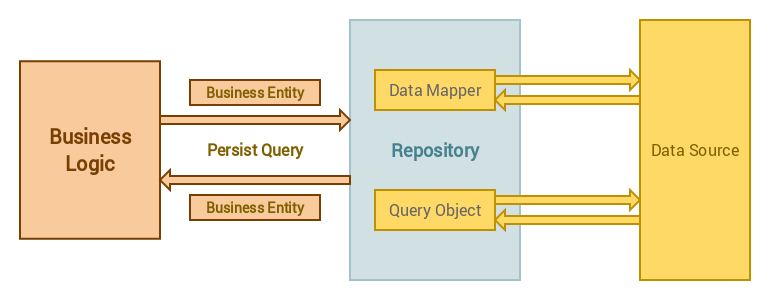
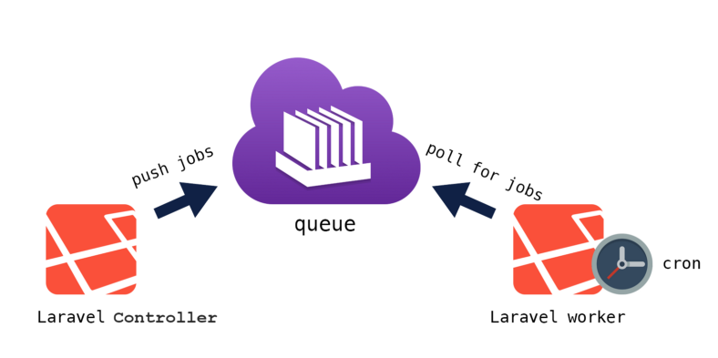

# Laravel Burger Ordering System

This is a Laravel-based web application for managing burger orders, ingredients, and stock levels.


## Technical Overview

### Database Design 

The relational structure of the database normalizes relationships between entities, promoting data integrity and minimizing redundancy.

### Architecture

The project follows the principles of Clean Architecture, separating concerns into layers for improved maintainability and testability. The key architectural components include:


### Repository Design Pattern

The repository design pattern is utilized to separate the data access layer from the application's core logic. This involves creating dedicated classes responsible for database interactions. By employing repositories, the application gains independence from the underlying database technology, Furthermore, the repository pattern promotes effective unit testing by enabling the use of mock repositories in testing scenarios.

- **Controllers:** Handle incoming HTTP requests and interact with the application.
- **Services:** Contain the business logic and coordinate interactions between repositories.
- **Repositories:** Interface with the database to retrieve and persist data.
- **Models:** Represent entities in the system, such as Order, Product, and Ingredient.



### Mail notifications Handling

To improve application performance and responsiveness, email notifications are asynchronously processed using Laravel's mail queue, jobs, and events. When the ingredient stock falls below a specified percentage, an event is triggered. This event is linked to a job responsible for sending the email. Additionally, this approach enhances scalability, enabling the system to efficiently manage a high volume of orders and notifications.


### Usage of DB::transaction for Performance

In the codebase, you will find the use of `DB::transaction` for certain operations, specifically in the `placeOrder` method. This usage is intentional and serves the following purposes:

#### Performance Optimization

The `DB::transaction` method is employed to encapsulate a series of database operations within a single transaction. This approach enhances performance by minimizing the number of commits and rollbacks, especially when dealing with multiple database updates.

#### Atomic Operations

Inside the transaction, multiple database operations are performed. If any of these operations fail and an exception is thrown, the entire transaction will be rolled back, ensuring that the database remains in a consistent state.

#### Avoiding Rollbacks for Stock Deductions

To optimize the deduction of stock from ingredients, a `CASE` statement is utilized within the transaction. This allows for a single SQL query to update multiple rows in a batch, improving efficiency. Additionally, this approach helps avoid partial stock updates, as the entire transaction is rolled back in case of any insufficient stock scenario.


## Getting Started

### Prerequisites

- PHP 8.0 or higher
- Composer
- MySQL or any compatible database

### Installation

1. Clone the repository:

   ```bash
   git clone https://github.com/tariqsenosy/burger-ingredient.git
   cd burger-ingredient

2. Install PHP dependencies:
    ```bash
    composer install
3. Create a .env file by copying .env.example and update the database 
    ```bash
    cp .env.example .env
4. Generate application key:
    ```bash
    php artisan key:generate
5. Run migrations and seed the database:
    ```bash
    php artisan migrate --seed
6. Start the development server:
    ```bash
    php artisan serve
7. Testing
    ```bash
    php artisan test