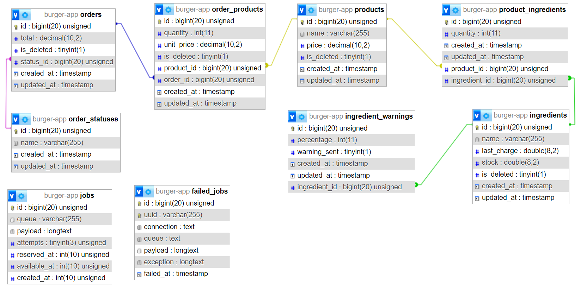
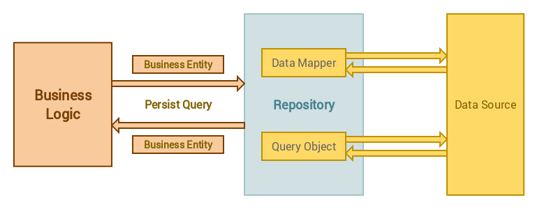

# Laravel Burger Ordering System

This is a Laravel-based web application for managing burger orders, ingredients, and stock levels.


## Technical Overview

### Database Design 


### Architecture

The project follows the principles of Clean Architecture, separating concerns into layers for improved maintainability and testability. The key architectural components include:

- **Controllers:** Handle incoming HTTP requests and interact with the application.
- **Services:** Contain the business logic and coordinate interactions between repositories.
- **Repositories:** Interface with the database to retrieve and persist data.
- **Models:** Represent entities in the system, such as Order, Product, and Ingredient.


### Repository Design Pattern

The repository design pattern is utilized to separate the data access layer from the application's core logic. This involves creating dedicated classes responsible for database interactions. By employing repositories, the application gains independence from the underlying database technology, facilitating easier transitions to alternative storage solutions. Furthermore, the repository pattern promotes effective unit testing by enabling the use of mock repositories in testing scenarios.


### Mail notifications Handling

To improve application performance and responsiveness, email notifications are asynchronously processed using Laravel's mail queue, jobs, and events. When the ingredient stock falls below a specified percentage, an event is triggered. This event is linked to a job responsible for sending the email. Additionally, this approach enhances scalability, enabling the system to efficiently manage a high volume of orders and notifications.

## Getting Started

### Prerequisites

- PHP 8.0 or higher
- Composer
- MySQL or any compatible database

### Installation

1. Clone the repository:

   ```bash
   git clone https://github.com/tariqsenosy/burger-ingredient.git
   cd burger-ingredient

2. Install PHP dependencies:
    ```bash
    composer install
3. Create a .env file by copying .env.example and update the database 
    ```bash
    cp .env.example .env
4. Generate application key:
    ```bash
    php artisan key:generate
5. Run migrations and seed the database:
    ```bash
    php artisan migrate --seed
6. Start the development server:
    ```bash
    php artisan serve
7. Testing
    ```bash
    php artisan test